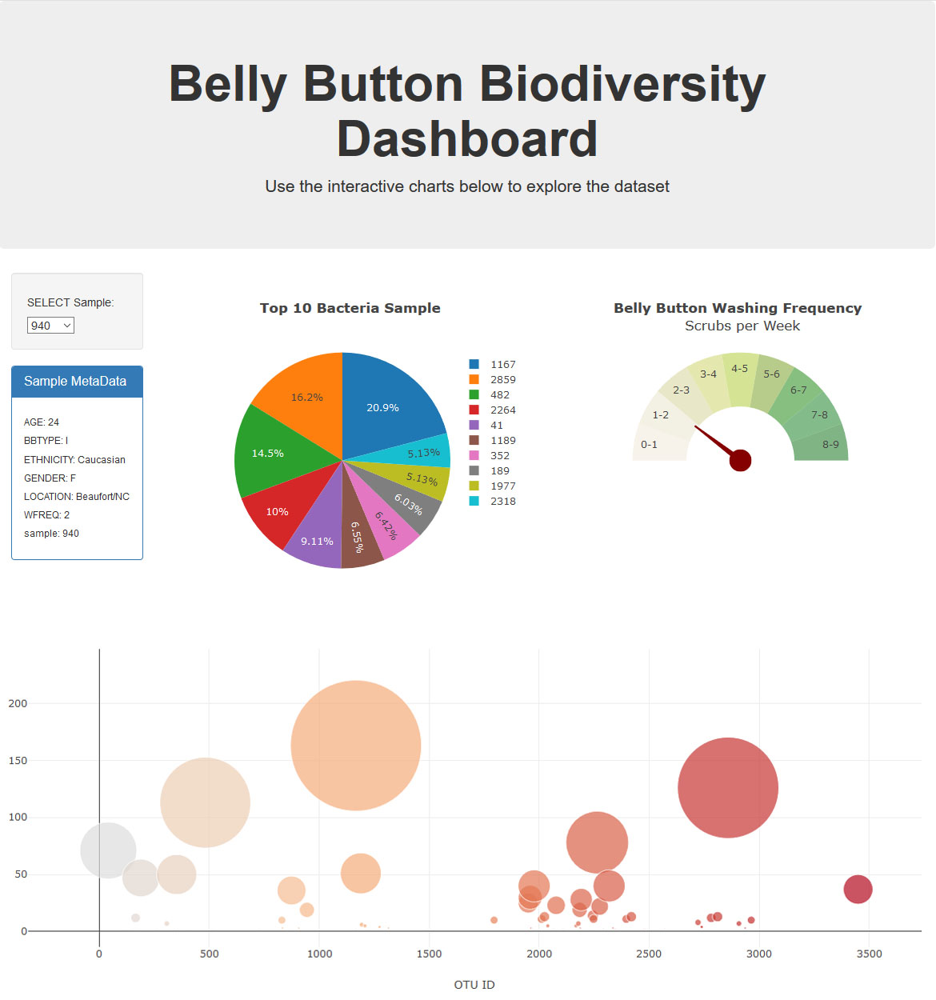

# Belly Button Biodiversity

In this assignment, I built an interactive dashboard to explore the [Belly Button Biodiversity DataSet](http://robdunnlab.com/projects/belly-button-biodiversity/).

## Heroku App
https://belly-button-biodiversity-xl.herokuapp.com/

## Steps required to use the App Locally
1) Clone Repository.
1) Go into StarterCode folder.
1) Go into Belly_Button_Biodiversity folder.
1) Run app.py file using a Python/Flask compiler.
1) Type in the URL populated by the compiler into a browser.

