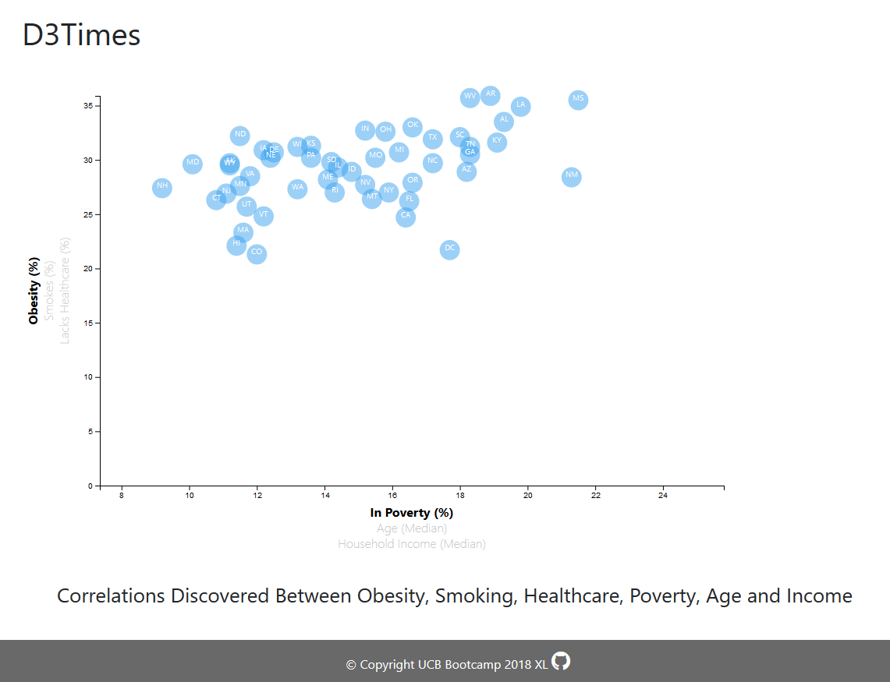

# Unit 16 | Assignment - Data Journalism and D3

## Background

Welcome to the newsroom! You've just accepted a data visualization position for a major metro paper. You're tasked with analyzing the current trends shaping people's lives, as well as creating charts, graphs, and interactive elements to help readers understand your findings.

The editor wants to run a series of feature stories about the health risks facing particular demographics. She's counting on you to sniff out the first story idea by sifting through information from the U.S. Census Bureau and the Behavioral Risk Factor Surveillance System.

The data set included with the assignment is based on 2014 ACS 1-year estimates: [https://factfinder.census.gov/faces/nav/jsf/pages/searchresults.xhtml](https://factfinder.census.gov/faces/nav/jsf/pages/searchresults.xhtml), but you are free to investigate a different data set. The current data set incldes data on rates of income, obesity, poverty, etc. by state. MOE stands for "margin of error."

---

### To view the file

#### Using Firefox or Edge
1) Git clone
1) Open index.html file

#### Using Chrome
1) Git clone
1) Open VSCode, select folder, open terminal, type python -m http.server
1) http://localhost:8000/
  
  
